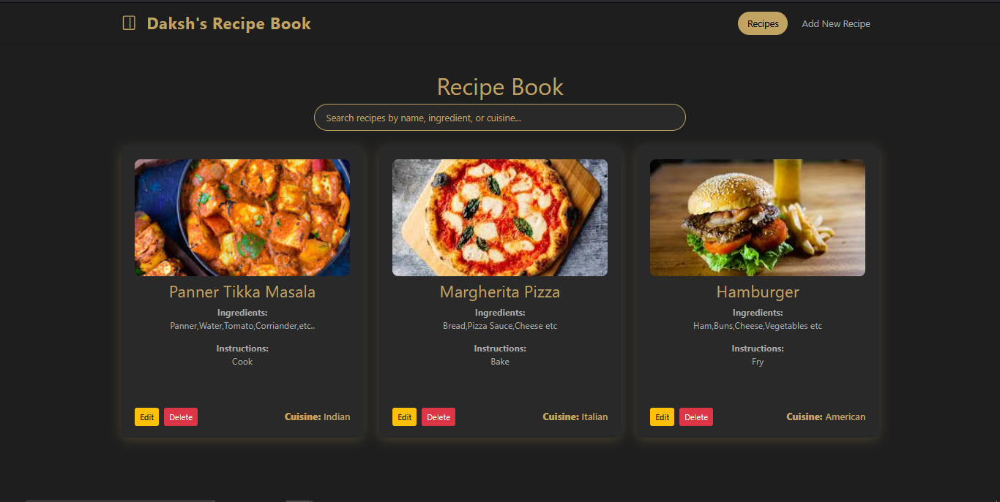

# Daksh's Recipe Book

A modern, stylish web app to add, view, search, edit, and delete your favorite recipes.  
Built with **HTML**, **CSS (Bootstrap + custom styles)**, and **JavaScript** using browser localStorage.

Deploy Link :- https://js-practical.vercel.app 


---

## Features

- **Add Recipes:** Enter recipe name, image URL, cuisine type, ingredients, and instructions.
- **View Recipes:** All recipes are displayed as stylish cards.
- **Search:** Instantly filter recipes by name, ingredients, or cuisine.
- **Edit & Delete:** Update or remove any recipe with a click.
- **Responsive Design:** Looks great on desktop and mobile.
- **Persistent Storage:** Recipes are saved in your browser (localStorage).

---

## Getting Started

1. **Clone or Download** this repository.
2. Open `index.html` in your browser to view and search recipes.
3. Open `addRecipe.html` to add a new recipe.

---

## File Structure

```
JS-Practical/
│
├── index.html         # Main page to view/search recipes
├── addRecipe.html     # Page to add a new recipe
├── script.js          # Handles adding recipes to localStorage
├── display.js         # Handles displaying, searching, editing, deleting recipes
├── style.css          # Main styles (theme, cards, navbar)
├── component.css      # Button styles
└── README.md          # This file
```

---

## Customization

- **Theme Colors:** Easily change in `style.css` using the `:root` variables.
- **Card & Navbar Styles:** Tweak Bootstrap and custom CSS for your own look.

---

## Credits

- [Bootstrap 5](https://getbootstrap.com/)
- [Uiverse.io](https://uiverse.io/) for button inspiration

---

##